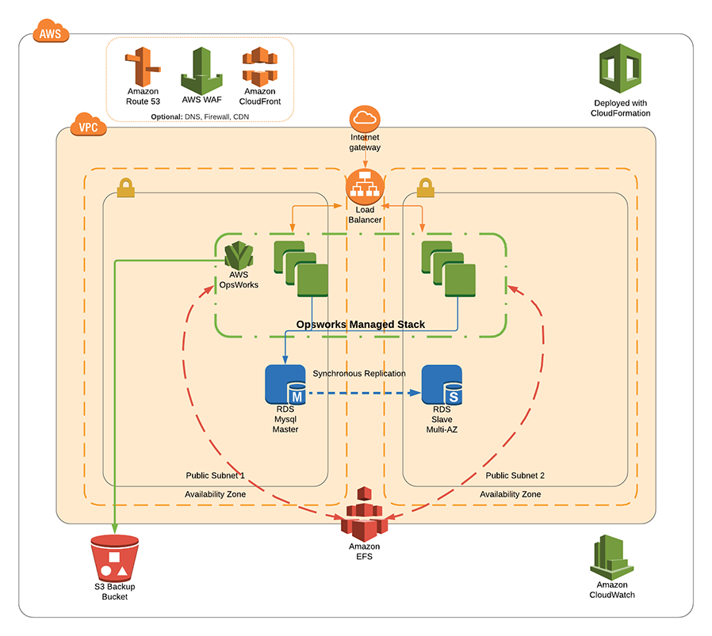

# Solodev Enterprise (OpsWorks)
Launch your website to the next level with the proven power of the Solodev and the AWS Cloud. Now you can focus on managing your website – and not your hardware. With AWS, there’s no need to spend time and money maintaining servers and data centers. Deploy Solodev Enterprise (Opsworks) to build a website that can handle virtually any amount of traffic, leverage mutliple geographic data centers for unmatched redundancy, and securely host your web experience.

## Overview
Solodev Enterprise (OpsWorks) on AWS uses a set of YAML templates including [Amazon Virtual Private Cloud (VPC)](http://docs.aws.amazon.com/AmazonVPC/latest/UserGuide/VPC_Introduction.html), [Amazon Elastic Compute Cloud (EC2)](http://docs.aws.amazon.com/AWSEC2/latest/UserGuide/concepts.html), [Amazon Elastic Load Balancing (Application Load Balancer)](https://docs.aws.amazon.com/elasticloadbalancing/latest/application/introduction.html), [Amazon Relational Database Service (RDS)](http://docs.aws.amazon.com/AmazonRDS/latest/UserGuide/Welcome.html), [Amazon Elastic File System (EFS)](http://docs.aws.amazon.com/efs/latest/ug/whatisefs.html), [Amazon Simple Storage Service (S3)](https://docs.aws.amazon.com/AmazonS3/latest/dev/Welcome.html), [Amazon CloudFront](http://docs.aws.amazon.com/AmazonCloudFront/latest/DeveloperGuide/Introduction.html), [Amazon Route 53](http://docs.aws.amazon.com/Route53/latest/DeveloperGuide/Welcome.html), [Amazon Certificate Manager (ACM)](https://docs.aws.amazon.com/acm/latest/userguide/acm-overview.html), [Amazon Web Application Firewall (WAF)](https://docs.aws.amazon.com/waf/latest/developerguide/what-is-aws-waf.html) managed by [Amazon OpsWorks](https://docs.aws.amazon.com/opsworks/latest/userguide/welcome.html) and deployed by [AWS CloudFormation](http://docs.aws.amazon.com/AWSCloudFormation/latest/UserGuide/Welcome.html).

## Prerequisites
To launch Solodev Enterprise (OpsWorks), you must first "Subscribe" to Solodev on the AWS Marketplace
1. Visit <a href="https://aws.amazon.com/marketplace/pp/B01LXZKO21?qid=1534773581495&sr=0-1&ref_=srh_res_product_title">Solodev on the AWS Marketplace</a>
2. Click on the "Continue to Subscribe" button
3. Click the "Subscribe" button
3. Return to this page and use one of the "Launch" buttons below

The following is a list of prerequisites need to launch a stack. Please note that each of the following must be configured within the region you intend to launch the stack. If the following items are already created, you can skip to launch.
1. <a href="https://console.aws.amazon.com/vpc/home?region=us-east-1#vpcs:">VPC</a>
2. <a href="https://console.aws.amazon.com/ec2/v2/home?region=us-east-1#KeyPairs:sort=keyName">EC2 Key Pair</a>

## Steps to Run
To launch the entire stack and deploy on AWS, click on one of the ***Launch Stack*** links below.

You can launch this CloudFormation stack, using your account, in the following AWS Regions:

<table>
	<tr>
		<th width="299">AWS Region Code</td>
		<th width="299">Name</td>
		<th width="299" align="center">Launch</td>
	</tr>
	<tr>
		<td>us-east-1</td>
		<td>US East (N. Virginia)</td>
		<td align="center"><a href="https://console.aws.amazon.com/cloudformation/home?region=us-east-1#/stacks/new?stackName=solodev-cms&templateURL=https://s3.amazonaws.com/solodev-aws-ha/aws/solodev-enterprise-cluster.yaml"></td>
	</tr>
	<tr>
		<td>us-east-2</td>
		<td>US East (Ohio)</td>
		<td align="center"><a href="#"></td>
	</tr>
	<tr>
		<td>us-west-1</td>
		<td>US West (N. California)</td>
		<td align="center"><a href="#"></td>
	</tr>
	<tr>
		<td>us-west-2</td>
		<td>US West (Oregon)</td>
		<td align="center"><a href="#"></td>
	</tr>
	<tr>
		<td>eu-west-1</td>
		<td>EU (Ireland)</td>
		<td align="center"><a href="#"></td>
	</tr>
	<tr>
		<td>eu-west-2</td>
		<td>EU (London)</td>
		<td align="center"><a href="#"></td>
	</tr>
	<tr>
		<td>eu-central-1</td>
		<td>EU (Frankfurt)</td>
		<td align="center"><a href="#"></td>
	</tr>
	<tr>
		<td>eu-central-2</td>
		<td>Canada (Central)</td>
		<td align="center"><a href="#"></td>
	</tr>
</table>

The above links will launch the "Select Template" wizard with the master template preselected. Click the "Next" button to customize the launch parameters.

## Parameters

<table>
	<tr>
		<th width="200">Parameter</th>
		<th width="698">Description</th>
	</tr>
	<tr>
		<td>Stack name</td>
		<td> The name of your stack (set to "solodev-cms" by default)</td>
	</tr>
	<tr>
		<td colspan="2" align="center"><strong>Network Configuration</strong></td>
	</tr>
	<tr>
		<td>Which VPC should this be deployed to?</td>
		<td>Select which VPC the Application should be deployed to</td>
	</tr>
	<tr>
		<td>Subnets</td>
		<td>Select at least two public subnets for this application</td>
	</tr>
	<tr>
		<td>(Optional) FQDN</td>
		<td>URL for app. FQDN must be pointed to CNAME of ALB.</td>
	</tr>
	<tr>
		<td>(Optional) CertficateArn</td>
		<td>SSL cert for HTTPS listener that matches the FQDN above</td>
	</tr>
	<tr>
		<td colspan="2" align="center"><strong>Server Configuration</strong></td>
		<td></td>
	</tr>
	<tr>
		<td>InstanceType</td>
		<td>EC2 instance type</td>
	</tr>
	<tr>
		<td>KeyName </td>
		<td>Name of an existing EC2 KeyPair to enable SSH access to the instances</td>
	</tr>
	<tr>
		<td colspan="2" align="center"><strong>Solodev Configuration</strong></td>
	</tr>
	<tr>
		<td>AdminUser</td>
		<td>Admin user name in order to log in to the CMS after installation</td>
	</tr>
	<tr>
		<td>AdminPassword</td>
		<td>Admin account password in order to log in to the CMS after installation</td>
	</tr>
	<tr>
		<td>DatabasePassword</td>
		<td>The database root account password</td>
	</tr>
	<tr>
		<td>DevOpsFlavor</td>
		<td>Which DevOps tools would you like to use to manage auto scaling (set to "Opsworks" by default)</td>
	</tr>
	<tr>
		<td>RestoreBucketName</td>
		<td>Name of the S3 bucket containing files for restore</td>
	</tr>
	<tr>
		<td>AMI</td>
		<td>Build AMI - Please leave this blank unless told otherwise</td>
	</tr>
</table>

## FAQs
1. Lorem ipsum dolor sit amet?
> Excepteur sint occaecat cupidatat non proident, sunt in culpa qui officia deserunt mollit anim id est laborum.

2. Lorem ipsum dolor sit amet?
> Excepteur sint occaecat cupidatat non proident, sunt in culpa qui officia deserunt mollit anim id est laborum.

3. Lorem ipsum dolor sit amet?
> Excepteur sint occaecat cupidatat non proident, sunt in culpa qui officia deserunt mollit anim id est laborum.

## Support
Houston, we have no problems – because Solodev has your back at every step, with 24x7x365 U.S. based support. From our world-class HelpDesk, email support, phone access, or face-to-face training sessions, you've got the best team in the business to help your mission succeed.

* Submit online support tickets
* Access dedicated support team members who know your business
* Benefit from in-depth product training from the Solodev Team
* Benefit from in-depth product training from the Solodev Team

---
© 2018 Solodev. All rights reserved. 

Errors or corrections? Email us at help@solodev.com.

---
Visit [solodev.com](https://www.solodev.com/) to learn more.

