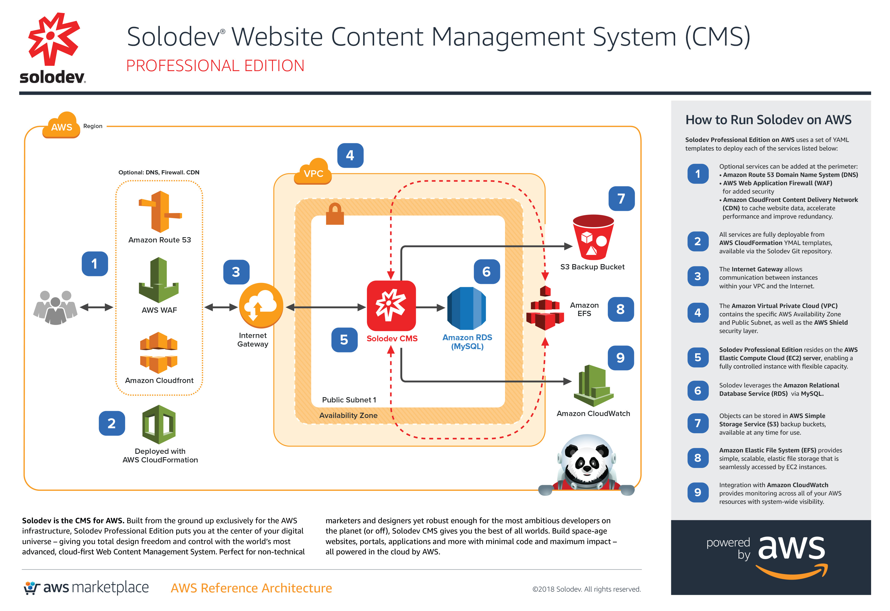
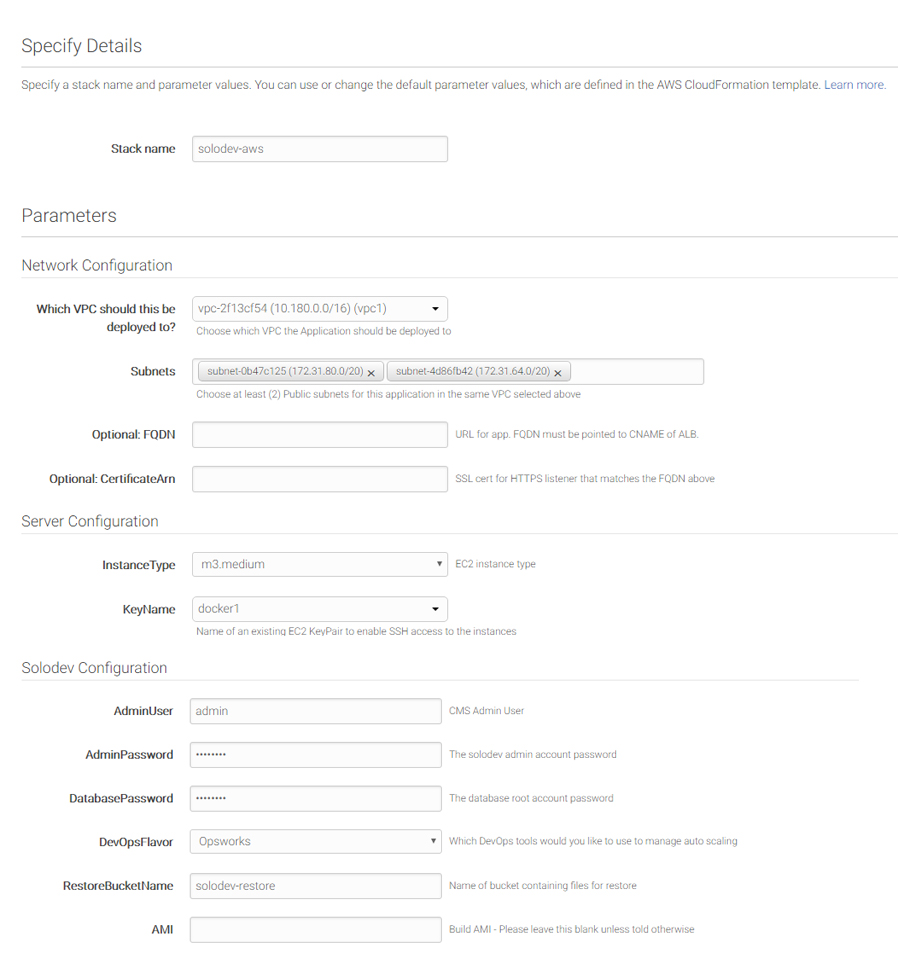

# Solodev CMS - Professional Edition
Take command of your digital universe! Get the full power of the galaxy's most advanced CMS and take your design and development to the stars and beyond. Professional Edition includes Solodev CMS, PHP, Apache, and Mongo on a single web server with an external RDS MySQL database – and available on-demand in the <a href="https://aws.amazon.com/marketplace/pp/B01LXZKO21?qid=1534773581495&sr=0-1&ref_=srh_res_product_title">AWS Marketplace</a>.

## Overview
Solodev CMS - Professional Edition on AWS uses a set of YAML templates including [Amazon Virtual Private Cloud (VPC)](http://docs.aws.amazon.com/AmazonVPC/latest/UserGuide/VPC_Introduction.html), [Amazon Elastic Compute Cloud (EC2)](http://docs.aws.amazon.com/AWSEC2/latest/UserGuide/concepts.html), [Amazon Relational Database Service (RDS)](http://docs.aws.amazon.com/AmazonRDS/latest/UserGuide/Welcome.html), [Amazon Simple Storage Service (S3)](https://docs.aws.amazon.com/AmazonS3/latest/dev/Welcome.html), [Amazon CloudWatch](https://docs.aws.amazon.com/AmazonCloudWatch/latest/monitoring/WhatIsCloudWatch.html), [Amazon CloudFront](http://docs.aws.amazon.com/AmazonCloudFront/latest/DeveloperGuide/Introduction.html), [Amazon Route 53](http://docs.aws.amazon.com/Route53/latest/DeveloperGuide/Welcome.html), [Amazon Web Application Firewall (WAF)](https://docs.aws.amazon.com/waf/latest/developerguide/what-is-aws-waf.html) and deployed by [AWS CloudFormation](http://docs.aws.amazon.com/AWSCloudFormation/latest/UserGuide/Welcome.html).

## How to Launch Solodev CMS
Getting to the Solodev Launchpad is easy. In just a few short steps, you'll be lifting off on AWS.
<b>1. Choose your subscription model:</b> Solodev is a professionally managed, enterprise-class Content Management System (CMS). Before launching one of our products, you'll first need to subscribe to Solodev via <a href="https://aws.amazon.com/marketplace/pp/B01LXZKO21?qid=1534773581495&sr=0-1&ref_=srh_res_product_title">AWS Marketplace</a> or fill out the <a href="#">Enterprise Activation Form</a> on our website. You can also call <a href="1.800.859.7656">1-800-859-7656</a> for enterprise pricing, and we can activate your account for you. Click one of the buttons below to begin: 
<table>
	<tr>
		<td width="50%"></td>
		<td></td>
	</tr>
</table> 
<b>2. Return to this page:</b> Once you complete your subscription in either the AWS Marketplace or via the Solodev Enterprise Activation Form (or by phone), simply return to this page.  
<b>3. Configure your VPC and EC2 Key Pair:</b> Please note that both a <a href="http://docs.aws.amazon.com/AmazonVPC/latest/UserGuide/VPC_Introduction.html">VPC</a> and <a href="http://docs.aws.amazon.com/AWSEC2/latest/UserGuide/concepts.html">EC2 Key Pair</a> must be configured within the region you intend to launch your stack. If the following items are already created, you can skip directly to launch.  
<b>4. Launch your CloudFormation stack:</b> You can launch your CloudFormation stack using your AWS account in the following AWS Regions:  

<table>
	<tr>
		<th width="299">AWS Region Code</td>
		<th width="299">Name</td>
		<th width="299" align="center">Launch</td>
	</tr>
	<tr>
		<td>us-east-1</td>
		<td>US East (N. Virginia)</td>
		<td align="center"><a href="https://console.aws.amazon.com/cloudformation/home?region=us-east-1#/stacks/new?stackName=solodev-cms&templateURL=https://s3.amazonaws.com/solodev-aws-ha/aws/solodev-lite-single.yaml"></td>
	</tr>
	<tr>
		<td>us-east-2</td>
		<td>US East (Ohio)</td>
		<td align="center"><a href="#"></td>
	</tr>
	<tr>
		<td>us-west-1</td>
		<td>US West (N. California)</td>
		<td align="center"><a href="#"></td>
	</tr>
	<tr>
		<td>us-west-2</td>
		<td>US West (Oregon)</td>
		<td align="center"><a href="#"></td>
	</tr>
	<tr>
		<td>eu-west-1</td>
		<td>EU (Ireland)</td>
		<td align="center"><a href="#"></td>
	</tr>
	<tr>
		<td>eu-west-2</td>
		<td>EU (London)</td>
		<td align="center"><a href="#"></td>
	</tr>
	<tr>
		<td>eu-central-1</td>
		<td>EU (Frankfurt)</td>
		<td align="center"><a href="#"></td>
	</tr>
	<tr>
		<td>eu-central-2</td>
		<td>Canada (Central)</td>
		<td align="center"><a href="#"></td>
	</tr>
</table>
The above links will launch the "Select Template" wizard, with the master template preselected. Click the "Next" button to customize the launch parameters.

## Parameters
The following parameters must be configured to launch your Solodev CMS CloudFormation stack:

<table>
	<tr>
		<th width="300">Parameter</th>
		<th width="598">Description</th>
	</tr>
	<tr>
		<td>Stack name</td>
		<td> The name of your stack (set to "solodev-cms" by default)</td>
	</tr>
	<tr>
		<td colspan="2"><strong>--- Network Configuration ---</strong></td>
	</tr>
	<tr>
		<td>Which VPC should this be deployed to?</td>
		<td>Select which VPC the application should be deployed to</td>
	</tr>
	<tr>
		<td>Subnets</td>
		<td>Select at least two public subnets for this application</td>
	</tr>
	<tr>
		<td>(Optional) FQDN</td>
		<td>URL for app. FQDN must be pointed to CNAME of ALB.</td>
	</tr>
	<tr>
		<td>(Optional) CertficateArn</td>
		<td>SSL cert for HTTPS listener that matches the FQDN above</td>
	</tr>
	<tr>
		<td colspan="2"><strong>--- Server Configuration ---</strong></td>
	</tr>
	<tr>
		<td>InstanceType</td>
		<td>EC2 instance type</td>
	</tr>
	<tr>
		<td>KeyName </td>
		<td>Name of an existing EC2 KeyPair to enable SSH access to the instances</td>
	</tr>
	<tr>
		<td colspan="2"><strong>--- Solodev Configuration ---</strong></td>
	</tr>
	<tr>
		<td>AdminUser</td>
		<td>Admin user name in order to log in to the CMS after installation</td>
	</tr>
	<tr>
		<td>AdminPassword</td>
		<td>Admin account password in order to log in to the CMS after installation</td>
	</tr>
	<tr>
		<td>DatabasePassword</td>
		<td>The database root account password</td>
	</tr>
	<tr>
		<td>DevOpsFlavor</td>
		<td>Which DevOps tools would you like to use to manage auto scaling (set to "Opsworks" by default)</td>
	</tr>
	<tr>
		<td>RestoreBucketName</td>
		<td>Name of the S3 bucket containing files for restore</td>
	</tr>
	<tr>
		<td>AMI</td>
		<td>Build AMI - Please leave this blank unless told otherwise</td>
	</tr>
</table>

## Support
Houston, we have no problems – because Solodev has your back at every step, with 24x7x365 U.S. based support. From our world-class HelpDesk, email support, phone access, or face-to-face training sessions, you've got the best team in the business to help your mission succeed.

* Submit online support tickets
* Access over 600 pages of online documentation and tutorials
* Receive dedicated human support from team members who know your business
* Get in-depth training from Certified Solodev Engineers

---
© 2018 Solodev. All rights reserved. 

Errors or corrections? Email us at help@solodev.com.

---
Visit [solodev.com](https://www.solodev.com/) to learn more. 
